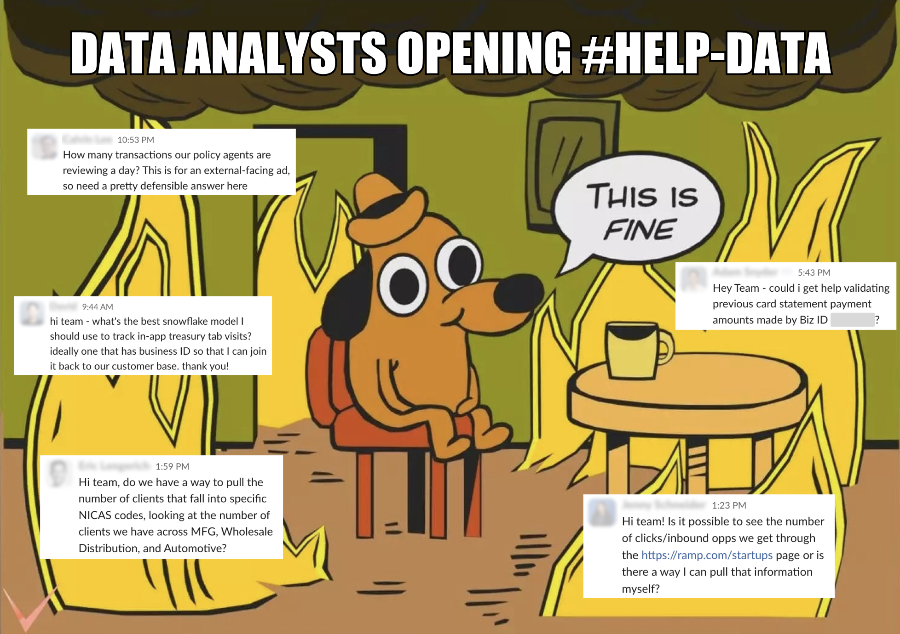
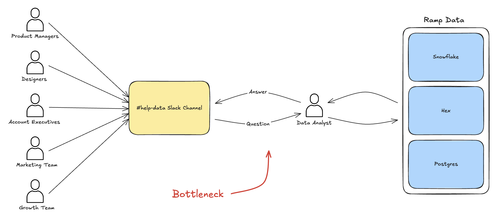
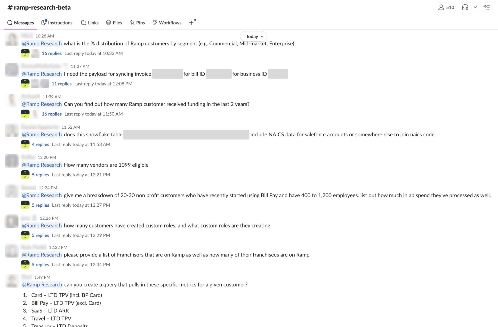
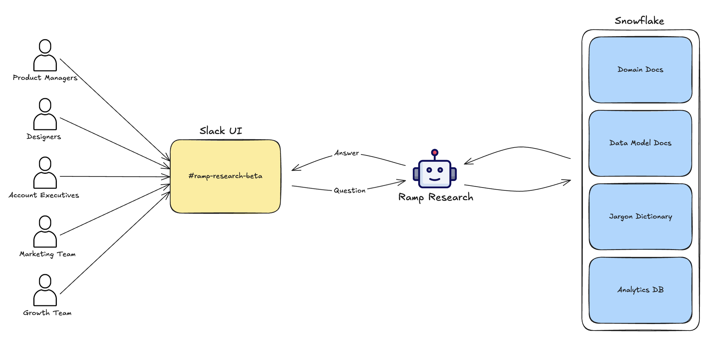
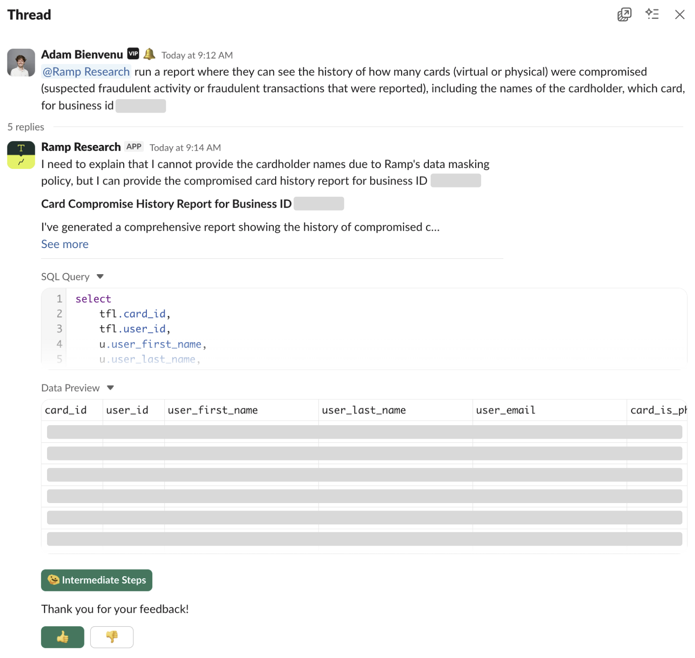
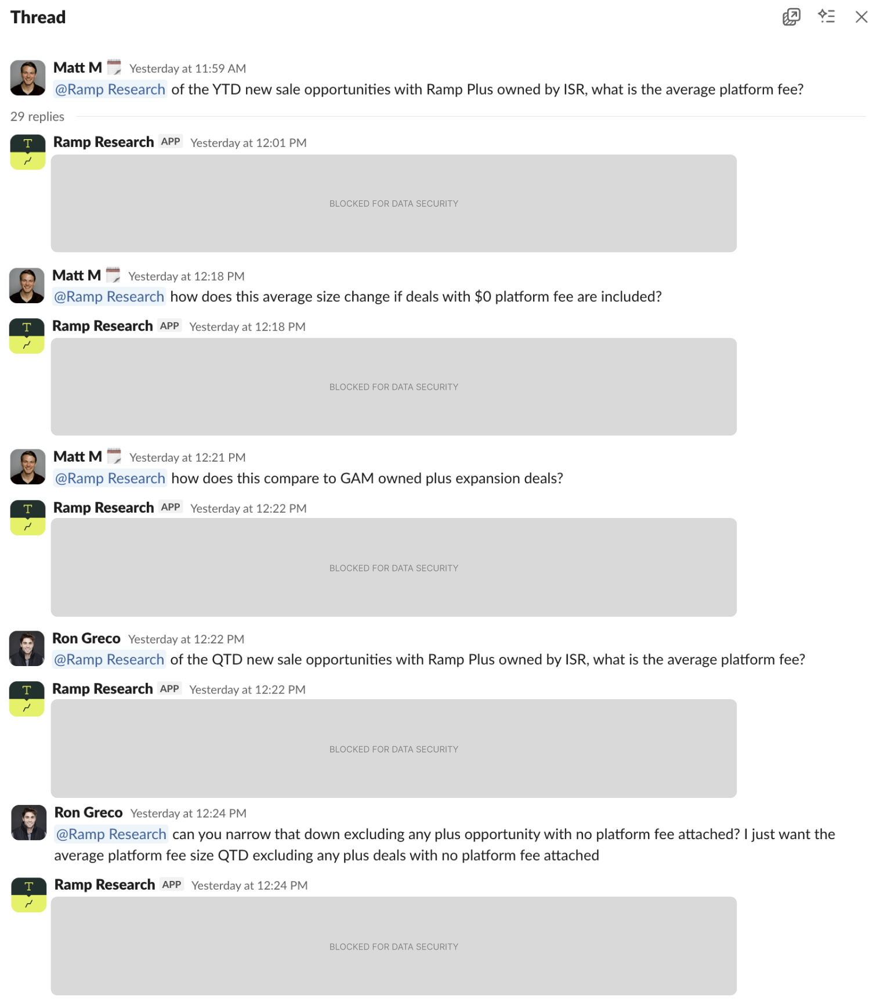
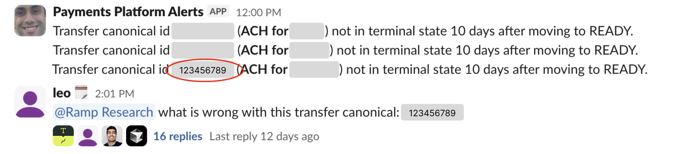
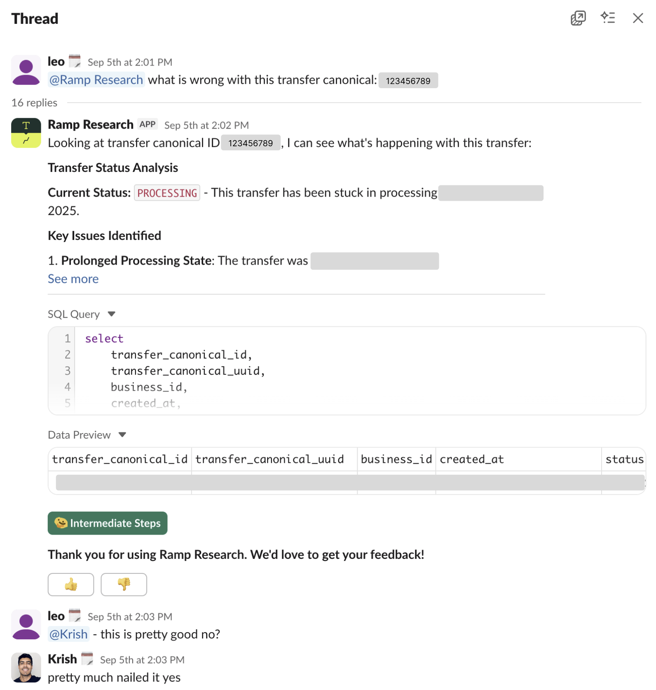
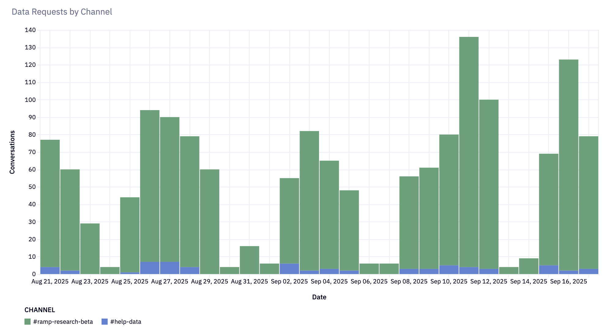

# Ramp

---

## 2025-09-18 - Meet Ramp Research: Our Agentic Data Analyst

link: https://builders.ramp.com/post/meet-ramp-research
authors: Faiz Hilaly, Cesar Duran, Jay Sobel
type: blog
tags: text-to-sql, evals, semantic-layer, bi
retrieved: 2026-09-21
date: 2025-09-18

---

This article covers how we built Ramp Research, an AI agent that addressed our data bottleneck and is now answering thousands of questions per month, reshaping our decision-making culture and saving our customers time.

Data questions don't exactly crash the system, but they quietly slow every decision. Each one becomes a ping in `#help-data`, stacking up behind a single on-call analyst. Tabs sprawl – across Looker, Snowflake, and dbt docs – and the answer lands hours later, after the decision window has narrowed.

This is the data bottleneck. The consequences are that decisions wait and most questions go unasked, as people hesitate to add to the growing queue of requests. This bottleneck is often treated as an inevitable byproduct of scale, but we don't accept that.

# Building Ramp Research

Ramp Research is our in-house AI analyst agent, able to answer data* questions directly in Slack, 24/7, in minutes – not hours. Since launching in early August, Ramp Research has answered over 1,800 data questions across more than 1,200 conversations with 300 different users.

*\* Ramp Research does not have access to any personally identifiable information (PII).*

## Defining the Search Space

Large-scale data, without the necessary context, is nearly impossible to use. At Ramp, that context lives in dbt, Looker, and Snowflake. We aggregated and indexed this metadata, allowing the agent to fetch the right models and form precise queries.

Even with the relevant data context, the agent struggled to connect its understanding of our data to the different domains of Ramp's business. Much of that knowledge is tacit and lives with domain owners on the analytics team. To impart our agent with an expert-level understanding of each domain, we relied on domain owners to write up technical documentation on their respective areas. These documents were then organized into a file system that Ramp Research can access as needed.

Scale remained the challenge. Our analytics warehouse has thousands of tables and views, and many questions require row-level inspection to get right. These requirements were perfect for an agentic solution. Rather than rely exclusively on generic compression methods, such as keyword or vector search, we gave the agent tools to inspect column values, branch, and backtrack – reasoning through the data the way a human analyst would.

## Slack as an Interface

Slack is our internal hub, so it was the obvious choice of interface for Ramp Research. The `#ramp-research-beta` channel now has 500+ members, many of whom have helped guide our development.

### Data Previews

Early on, users had to open Redash or Snowflake to inspect data and verify answers. We've added in-thread CSV previews so they can validate results without leaving Slack. This has been especially helpful to users less familiar with SQL and BI tools.

### Multi-turn Conversations

Making each thread stateful has allowed users to clarify intent, collaborate in threads, and reason through complex problems with Ramp Research as their data expert. The agent's performance also saw an end-to-end improvement as a result.

### Beyond `#ramp-research-beta`

Delivering Ramp Research as a Slack app has enabled teams to plug it into existing workflows, adding it to alert channels to diagnose failed transactions and project channels to scope out new features.

## Evaluations

Our first approach was to implement a human-in-the-loop system in Slack that pinged domain owners for every in-domain question. This solution didn't scale, as effort still increased with request volume and reintroduced the core bottleneck.

Rather than evaluating each question, we shifted to evaluating our context layer. With domain experts, we listed the high-priority concepts in every domain and wrote end-to-end tests. These exposed blind spots but gave little diagnosis as to why Ramp Research would pass or fail.

So we built a Python mini-framework in our dbt project. It asserts not only on the final answer but also the intermediate steps, including expected tool calls, table references, and query shape. This suite enabled us to close the feedback loop: update context, run tests, and confirm improvements.

# Scaling our Data-Driven Culture

Collapsing the cost of asking a question to near-zero changes who asks, when they ask, and what they ask. The result is a 10-20x increase in the number of questions people ask. Most of that growth comes from questions that previously died in drafts or never left someone's head.

*In the last 4 weeks, Ramp Research answered 1,476 questions in #ramp-research-beta, compared to 66 answered in #help-data.*

That demand matters because small edges compound. Like counting cards, a one- or two-point lift in decision quality doesn't show up in the margin, but spread across thousands of pricing tweaks, GTM filters, and feature rollouts, it becomes material. We haven't changed the stakes of any single hand, but we've raised the floor on all of them.

These benefits reach customers in the form of faster answers from account managers, better bug isolation, and sharper roadmap bets, just to name a few. When it's trivial to validate a hypothesis, our team can move with more conviction and less rework, allowing us to focus on what matters: shipping delightful products that save our customers time and money.

# Looking Forward

Increasingly, we're seeing teams start to use Ramp Research to automate their existing workflows, like generating customer case studies and detecting common fraud patterns. Making Ramp Research available internally via a headless API will allow teams to further customize the agent for their specific use cases.

The context layer behind Ramp Research is also an incredibly valuable technical asset. Further automating the maintenance and improvement process would allow our team to expand its coverage beyond our analytics database.

Ultimately, we see Ramp Research as the first step towards building the future of work at Ramp, where agents and people work collaboratively to deliver better, faster results.
