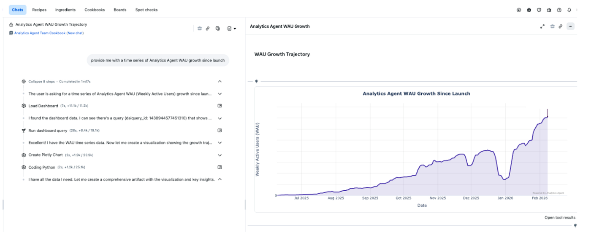
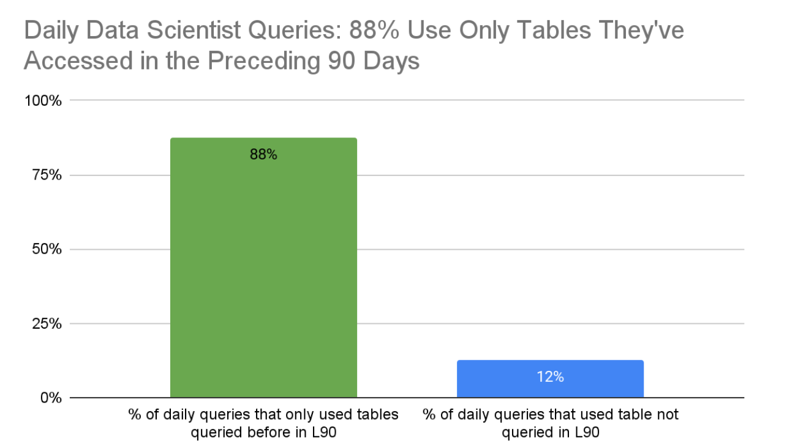
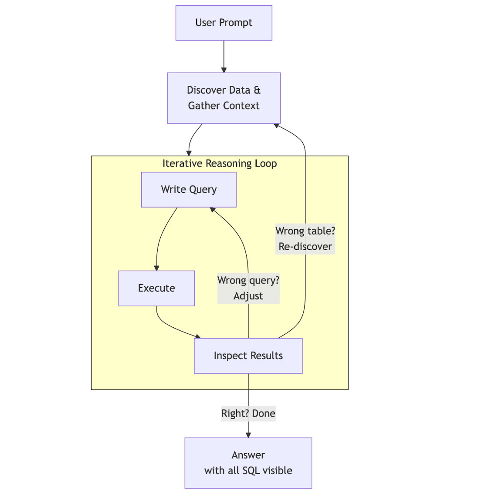
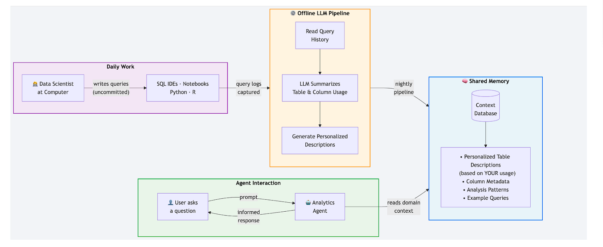
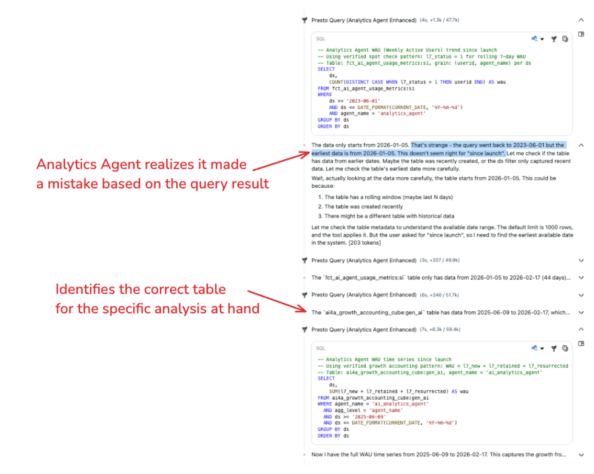
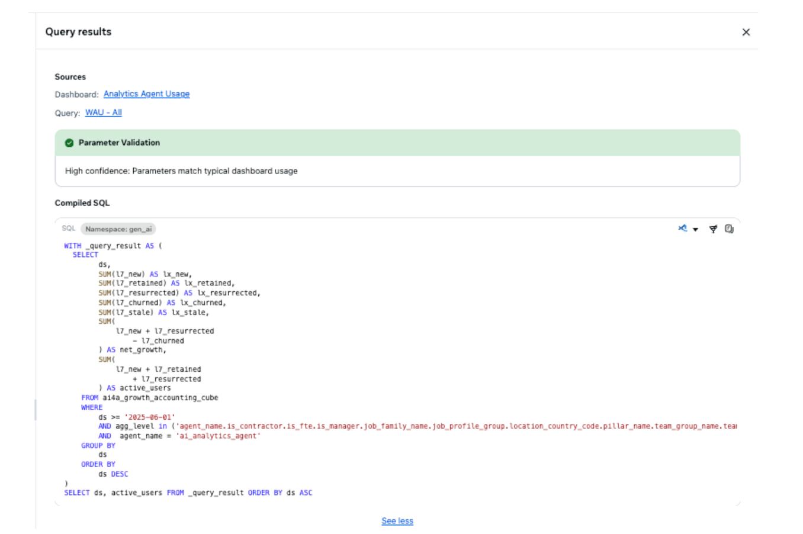
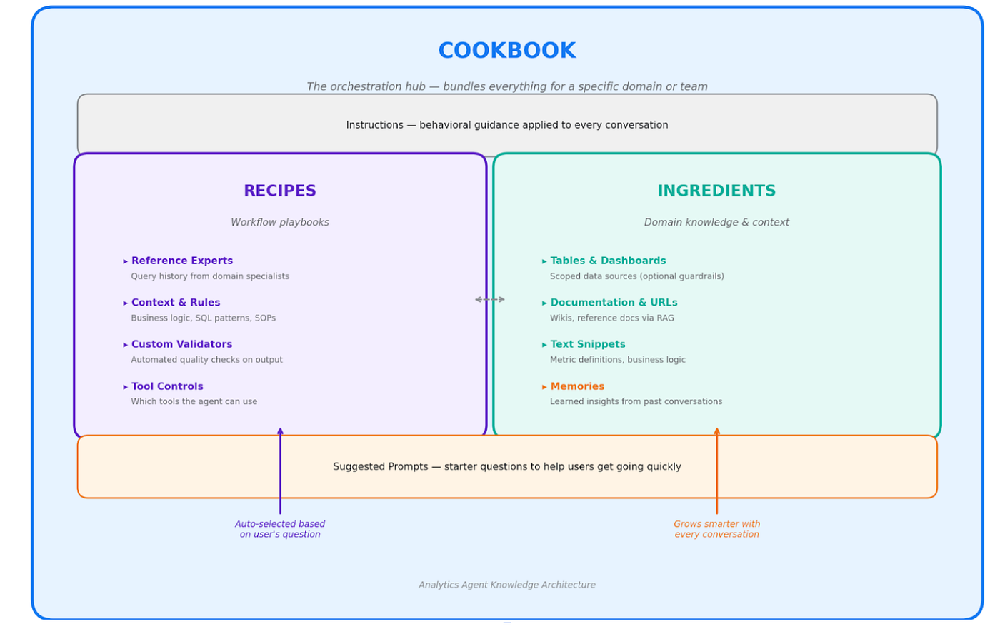

# Meta

---

## 2026-03-30 - Inside Meta's Home Grown AI Analytics Agent

link: https://medium.com/@AnalyticsAtMeta/inside-metas-home-grown-ai-analytics-agent-4ea6779acfb3
authors: Analytics at Meta (team byline)
type: blog
tags: text-to-sql, semantic-layer, agent-harness, evals
retrieved: 2026-09-21

---

## From Hack to Company-Wide Tool

The hypothesis was simple: can an AI agent perform routine data analysis tasks autonomously? Data scientists tend to get asked similar questions over and over, working within a familiar set of tables. An agent seeded with context about which tables a person queries, and how they use them, might be able to handle much of this work on its own.

To test the idea, a data scientist on the team used Meta's internal coding agent to hack together a prototype on their devserver: an agent that could execute SQL against the internal data warehouse, with access to a few colleague's query history for context.

The first real-world trial started simply enough: after sharing the prototype with a colleague, they asked it to diagnose a drop in a health monitoring metric. The agent identified the right tables, ran several diagnostic queries on its own, and ultimately traced the root cause to a recent code change.

That was an ah-ha moment that shifted the conversation. Up until then, most data scientists had used AI for surface-level tasks like fixing SQL syntax, searching internal docs. But a fully autonomous agent that could run queries, reason about results, and decide what to investigate next got people excited enough to want to try it for many different applications!

So the agent moved off a devserver and into production. A small alpha group of data scientists gave direct feedback. A broader beta surfaced edge cases, for example, queries the agent got wrong, tools people needed, tables it couldn't find. Each round of iteration showed progress. We would fix what broke, add what was missing, open it up to more users, which luckily is the kind of fast iteration Meta's builder culture is designed for. Workplace posts and word-of-mouth did the rest. People would try it, get surprised by the results, and share it with their team and keep using it.

Within weeks, there were hundreds of weekly active users. As momentum grew, a dedicated engineering team formed around the project. Six months later, 77% of Meta's Data Scientists and Data Engineers use Analytics Agent on a weekly basis, along with roughly 5x as many users from non-data roles.

Below is an example of "Analytics Agent" doing analysis on its own growth!

But why did this work? How could a weekend prototype do work that normally takes an experienced analyst hours?

## The 80/20 Hypothesis: Making the Problem Tractable

The answer lies in a surprising property of data work: it's often far more repetitive than most people realize. Most analysis builds off of previous work rather than net-new exploration: 88% of queries by Data Scientists rely solely on tables they've queried in the preceding 90 days

This creates a constrained environment, and constrained environments are where AI excels. Meta's data warehouse has millions of tables, but any individual analyst's work typically lives within a few dozen. Just as AlphaGo succeeded by mastering a game with fixed rules rather than the open-ended real world, Analytics Agent often succeeds because each analyst's work lives within a bounded, learnable domain.

By giving Analytics Agent access to the history of tables each user has queried, in addition to AI generated descriptions of those tables based on past queries run against them, we seed it with the most critical context: what data matters to this person, how they use it, and what questions they tend to ask. This is the foundation everything else is built on.

## How Analytics Agent Works

An agent needs the same tools and context a human Data Scientist would have to accomplish a task. Our goal is to provide this scaffolding for Analytics Agent and otherwise get out of the way of the model's intelligence.

Two of the most important elements of scaffolding are around enriching the user prompt with context (Discover Data & Gather Context in the diagram below) and providing the right reasoning logic (Iterative Reasoning Loop). In addition we put a lot of effort into providing transparency to users on what data is used to answer their questions ("Answer").

## Discover Data & Gather Context

Before our agent begins any analysis it attempts to gather resources that will enable it to succeed, just like a Data Scientist. We try to ensure that the agent has the right personal context (e.g. users past history of analysis) as well as the right business context.

Data scientists at Meta develop deep expertise in a slice of the business. They analyze this data using SQL, Python, and R, but their work rarely gets committed to a repository. Instead, it lives scattered across query editors and notebooks, invisible to any system that might learn from it.

To bridge this gap, we build "shared memory" with each analyst. Offline LLMs process every query an employee has run, generating descriptions of the tables they use, how they use them, and what kinds of analyses they perform. These summaries, along with example queries and column-level documentation, are continuously refreshed and stored where the agent can retrieve them on demand.

This pipeline constructs the analyst's "domain" which is a bounded starting point that makes the problem tractable. Meta's data warehouse serves 70,000+ employees building everything from VR headsets to Facebook Marketplace. Without narrowing the scope upfront, the agent would waste time sifting through irrelevant context and would be far more likely to land on the wrong tables entirely. AI agents can't yet accumulate context the way humans do over months and years on a team. Personal query history bridges that gap by providing the cumulative knowledge that makes the agent genuinely useful from the very first interaction.

- You can even "clone" a colleague by pointing Analytics Agent at their query history which gives you instant access to their domain expertise without needing to ask them (e.g. Answer this question as if you were PersonA).

Beyond personal history, the agent needs access to the broader knowledge ecosystem: documentation, data warehouse metadata, data pipeline source code, semantic models. We index all of these and make them searchable which gives the agent the same reference materials a human analyst would consult.

With the right context/ability to gather context the agent, just like a human, is equipped to do the analysis.

## Iterative Reasoning Loop

Data analysis is a domain where an AI agent can close the loop entirely: write code, execute it, see real results, and decide what to do next. The cycle that normally happens between an analyst and their SQL editor now happens inside the agent.

An analyst can ask "why did signups drop last Tuesday?" and the agent will query the signup table, notice the numbers look normal, check for a logging change, find a deploy that altered the event schema, and surface the root cause. This happens all in a chain of queries that build on the last. While analysts can see every query and steer, Analytics Agent can often self correct.

Once the agent determines it has correctly identified the right context and has reached a solution, it returns an answer to the user.

## Answer

When we provide an answer to a user, transparency becomes critical. In analytics, trustworthy answers are the product which poses a real challenge given the nondeterministic nature of LLMs. Our approach to this is to show everything. Every data point Analytics Agent surfaces is accompanied by the SQL query that produced it, front and center.

## Advanced Features

Of course, once we had the agent working users wanted ways to add their own customizations and shortcuts to provide the agent with even richer context. An AI that already knows your team's data, your metrics, and your best practices is even more powerful than one that just has your personal query history.

To make that possible, we built a layered knowledge system around three concepts borrowed from the kitchen: Cookbooks, Recipes, and Ingredients. Together, they transform Analytics Agent from a general-purpose tool into a domain-specific expert that gets smarter over time.

## The Architecture at a Glance

## Cookbooks

A Cookbook is the entry point. It's a centralized package that bundles everything the agent needs to become a domain-specific expert: recipes, ingredients, business context, instructions, and suggested prompts. When someone starts a conversation from a Cookbook, the agent already knows the team's tables, metrics, best practices, and analytical patterns with no setup required.

## Recipes

Inside a Cookbook, Recipes define how the agent should analyze. Think of a Recipe as a "standard operating procedure" that encodes the analytical approach your team would use if a senior analyst were answering the question themselves.

Recipes can be explicitly chosen by the user or auto-selected, and the agent reads short descriptions of all enabled recipes and picks the most relevant one based on the question being asked. A Recipe typically includes some or all of the following:

- Reference Experts: Points the agent to specific people whose SQL query history it should learn from. This surfaces battle-tested query patterns, table choices, and filter logic.
- Context (Instructions): Persistent guidance appended to every conversation such as business rules, expected value ranges, SQL patterns, response templates, and domain-specific terminology.
- Custom Validations: Natural-language validation rules that a separate AI checks against the agent's output before presenting results. For example: "WAU should be < 8 billion" or "Always filter by is_test=false." This scales domain expertise into automated quality control.
- Tool Controls: Controls which tools the agent can use (e.g., only SQL queries, no Scuba), keeping it focused on the right data sources.

The key design principle: Recipes define what to do (workflows, analysis steps, response formats), but not what the data means. Data definitions belong in a separate layer called Ingredients.

## Ingredients

Recipes tell the agent how to analyze, but it also needs to know what the data actually means. That's where ingredients come in.

Ingredients are structured knowledge assets, like semantic models or wiki pages, that teams link to a Cookbook and apply through Recipes. A semantic model, for example, describes not just that a column called l7_active exists, but that it means "users active in the last 7 days, excluding churned accounts, measured at the country-day grain." A wiki page might document a team's metric definitions, mandatory filters, or known data quality issues.

By linking these knowledge sources as Ingredients and routing them through Recipes, teams encode institutional context once and make it available to every conversation in that domain. The agent doesn't need to rediscover that "revenue" means "net revenue after refunds" or that two tables should be joined on user_id and ds rather than user_id alone; it already knows, because the Ingredient told it so.

Teams can add several types of Ingredients:

- Semantic models: Pointers to the canonical data documentation for a domain, so the agent doesn't waste time searching millions of warehouse tables.
- Documentation & URLs: Links to metric definitions, wiki pages, and business context that ground the agent's understanding.
- Text Snippets: Free-form notes, naming conventions, known data quality issues, mandatory filters, or anything an experienced analyst would "just know."
- Memories: Corrections and learnings the agent accumulates over time from user feedback, so mistakes aren't repeated.

## How the Layers Work Together

The relationship between these concepts follows a clear hierarchy:

- Cookbooks are the package; they bundle the right recipes and ingredients together for a specific team or domain, with built-in learning loops that improve over time.
- Recipes define how to analyze; the workflow, the steps, the validation rules.
- Ingredients provide the what; the context agents need to understand a business domain.

The net effect: instead of every analyst on a team needing to know which tables to query, what filters to apply, and how to validate results, that knowledge is encoded once and shared with everyone through a Cookbook. The agent behaves like a domain expert from the first question, and gets better with each conversation.

## Key Learnings & Lessons

The foundation of Analytics Agent rests on a counterintuitive insight: Data scientists are often asked to deliver similar types of analyses and insights within their domain creating significant opportunities for automation to amplify their impact; and that's exactly where AI agents thrive. By seeding the agent with personal context, equipping it with the right tools, and keeping every step transparent, we've built something that doesn't replace the data scientist but scales them, giving everyone access to reliable answers. In building this agent we learned a ton of lessons. Below they are listed in no particular order.

## Start With a Falsifiable Bet

We had a specific hypothesis that, given 88% of queries by Data Scientists on any given day rely solely on tables queried in the preceding 90 days, an AI agent could perform these routine data analysis tasks autonomously. This wasn't a vague "AI could help with analytics" pitch, it was a specific, measurable hypothesis based on data.

- The lesson: don't start with a solution looking for a problem. Start with data that proves the problem is tractable.

## Personal Context Is a Killer Feature

Meta's data warehouse has millions of tables serving 70,000+ employees. Without narrowing the scope, any agent drowns in irrelevant context. The breakthrough was building "shared memory" with each analyst, offline LLM pipelines process every query an employee has run, generating descriptions of their tables, usage patterns, and analytical style. When the agent receives a question, it already knows the person's domain before writing a single line of SQL.

- The lesson: an AI agent without personalized context is just a chatbot with database access. Context is what transforms it into a domain expert.

Furthermore, while running SQL is table stakes, what differentiates good analysis from bad is domain knowledge, like which tables are canonical, what filters are mandatory, and which values are "normal." This led to the Recipes, Ingredients, and Cookbooks architecture: a layered knowledge system where teams encode analytical best practices into reusable configurations.

- The lesson: the agent is only as good as the domain knowledge it has access to. Build systems that make it easy for experts to teach the agent, not just use it.

## Show Your Work

In analytics, a wrong number presented confidently is worse than no number at all. Every data point Analytics Agent surfaces is accompanied by the SQL query that produced it, front and center. The Thinking UI shows planning and reasoning steps in real time. Users don't have to trust the agent blindly, and they can verify it, just as they'd review a colleague's SQL.

- The lesson: for analytical AI, showing your work isn't a nice-to-have, it's the core product requirement. Accuracy you can't verify isn't useful.

## Your Community Is Your Product Team

In H2 2025 alone we had 750+ feedback posts, 130+ wins & best practices posts, 40+ community talks. When users prototyped Python matplotlib integration, the team productionized it. When power users asked for programmatic access, the team shipped a feature for this within weeks. By the time of open beta, 4,500+ community-created recipes had been used 150,000 times.

- The lesson: treat your earliest users as co-builders, not beta testers. Their investment compounds and power users become evangelists, and the community extends the product faster than any roadmap.

## Ship Early, Learn Fast

Analytics Agent went from a weekend prototype on a devserver to a company-wide tool used by thousands in roughly six months. The first version was crude, but when it successfully traced a metric drop to a recent code change on its first real-world trial, it proved the concept. The team raised its adoption goal from 20% to 55% mid-half when growth exceeded expectations, and still overshot it. Each iteration made the next one faster, and each new user made the product better for everyone.

- The lesson: in a fast-moving AI landscape, the biggest risk isn't shipping too early, it's shipping too late. Real user feedback is worth more than any amount of fake testing.

---

Images from the source post are archived inline above.
